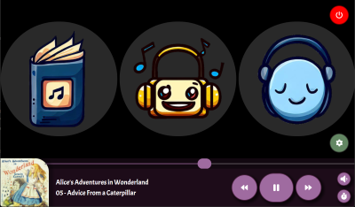
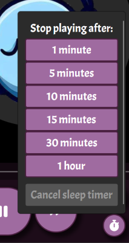
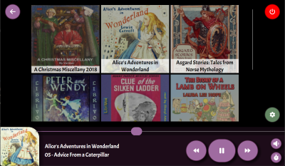
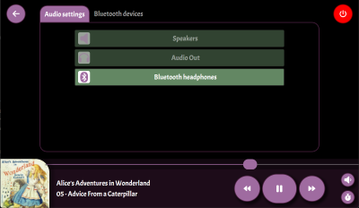
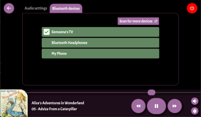

# Resona
An audiobook/music/sleep tunes audio player designed to run on a Raspberry Pi.

## Motivation

I wanted to have a single-use device for playing audio that my kids could safely use in their bedroom, without giving them a phone or tablet that also gave them other unhelpful distractions. 

This is a rebuild of an old project which had an ASP.NET core backend with a Blazor client. This new
version relies on [Avalonia UI](https://www.avaloniaui.net/). Having all the logic and UI combined in a single executable has proven to be much more efficient and development has been much quicker.
This all came together as a spare time project over the course of a couple of weeks.

You can clone and run this repo locally to try it out, and deploy it to a Raspberry Pi using the dev notes below. I might look to streamline the installation process at some point if there's
demand for it - I'd also be happy to receive contributions.

### Roadmap

I've a couple of things I still want to do:

* Expose a web application from the device that parents can use to upload new content, rather than using `scp` 😊
* Allow for more configuration options to allow kids to personalize things a bit, including the main icons for the home screen.


# Features

## Three sections for audio content

* Audiobooks
* Music
* Sleep Tunes



Files are added to the database by scanning a folder on the local filesystem. This is currently the well known location, `home/pi/audiobooks`, `home/pi/music` and `home/pi/sleep`.

## Sleep timers

* Sleep timer to stop playback after a set time
* Auto-shutdown on lack of interactivity (2 hours by default)
* Screen dimming to prevent glare at night (30 seconds by default)



## Album art

Album art is loaded from (in order of preference):

* `image.jpg` or `image.png` in the album folder
* The first `mp3` file in the album folder that contains an embedded image



## Playback

* Resona keeps track of the last played position of albums and will be ready to continue playing from the last played track when it restarts
* Scrubbing supported
* Volume control through the player in case your display doesn't have volume controls

## Audio output selection

Select the audio output channel through the UI:



Scan for and pair bluetooth devices:



# Dev notes

## Raspberry Pi installation

1. Install Raspberry Pi OS Lite. The easiest way to do this is with the [Raspberry Pi Imager](https://www.raspberrypi.com/software/), making sure you apply these settings before installing:
  * Set the host name to something unique on your network, e.g. `dev`
  * Enable SSH
  * Configure the wireless LAN
1. Install any dependencies for the touchscreen display attached to your Pi. 
1. Use `raspi-config` and change `System options > Boot / Auto Login` to `Console Autologin`.
1. From your dev computer run `copy-pi-scripts.ps1 -Server <PiName>` which will copy Resona scripts to your Pi.
1. From your Pi (SSH or direct), run `./install-dependencies.sh` and use one of them to install the relevant dependencies
1. (Optional) From your Pi, run `./configure-auto-run.sh` to configure Resona to auto run whenever your Pi starts up. If you don't do this you'll have to manually start Resona each time from 
   either your dev computer using SSH or the Pi itself by running `~/bin/Resona --drm`. You can temporarily disable the service using `./disable-auto-run.sh` and re-enable with 
   `./reenable-auto-run.sh`.

## Build and deploy Resona to your Pi

Run `publish.ps1 -Server <PiName>` to build and deploy the project to your Pi.

`publish.ps1` options:

* `-Server` - The name of the Pi to deploy to
* `-DebugBuild` Builds in debug mode with no trimming
* `-NoClean` Only makes sense when used when publishing with -DebugBuild. Only copies changes to the Resona assemblies, keeping the existing .NET framework and other dependencies. Can be used for a faster dev inner loop when testing code on the Pi.
* `-NoBuild` Deploys without rebuilding the packaged artifacts

Publishing will:

* Rebuild the project
* Stop and disable the service on the Pi (which will kill the app if it's running via the service)
* Copy the updated artifacts
* Re-enable and start the service on the Pi (if installed) - the app will auto run ready for you to play with it.

### Touchscreen installation

This section contains notes about the various touchscreens used during development.

#### Wimaxit 7" Capacitive with sound

Add this to the end of /boot/config.txt:

```
hdmi_force_edid_audio=1
max_usb_current=1
hdmi_force_hotplug=1
config_hdmi_boost=7
hdmi_group=2
hdmi_mode=87
hdmi_drive=2
display_rotate=0
hdmi_cvt 1024 600 60 6 0 0 0
```

#### 

## Database

Work on the core database structure is ongoing, so I'm just going to recreate the initial database structure every time I make a change using:

``` powershell
cd src\Resona.Persistence
rm -r Migrations
md Migrations
dotnet ef migrations add InitialCreate --startup-project ..\Resona.UI -o Migrations
```
